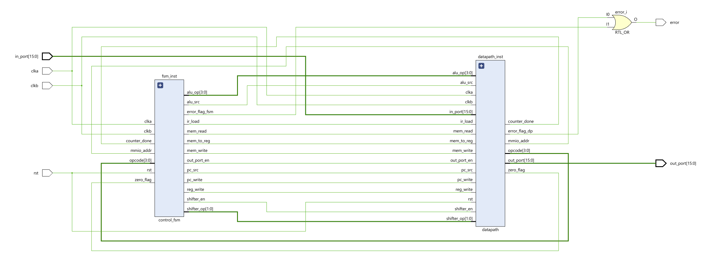
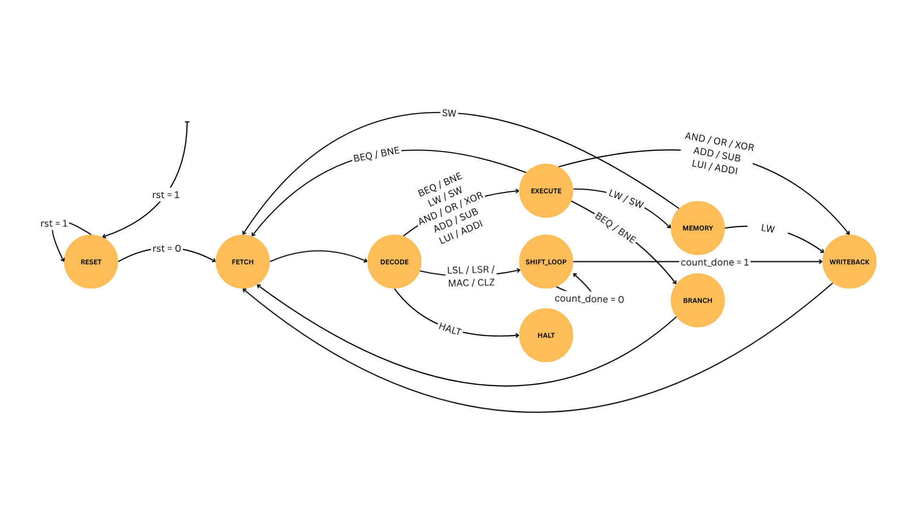

# SIWADO

  
  
<em>Figure 1: SIWADO architecture</em>

<figure>
  
  <figcaption>Figure 2: FSM Bubble Diagram</figcaption>
</figure>

## Overview
We propose the design and full custom implementation of a 16 bit RISC style microcontroller optimized for high density silicon integration within an approximate 1,000 gate constraint. The architecture utilizes a non pipelined, multi cycle execution model governed by a central finite state machine (FSM). This approach prioritizes hardware resource reuse, allowing for the implementation of complex mathematical functions without exceeding the transistor budget. The datapath consists of a 16 bit ALU, a 16 bit program counter, and a register file with eight general purpose registers (R0​–R7​). To maintain ISA consistency, all arithmetic operations utilize 16 bit two’s complement signed representation. Register R0​ is hardwired to logic zero, eliminating sixteen flip flops and simplifying common data movement operations. 
The system operates without external DRAM or an on-chip cache hierarchy. Data initialization is handled through immediate addressing instructions, and external communication is achieved via a memory-mapped I/O model with a dedicated 32-pad parallel interface, described in detail below.

## Instruction Set Architecture (ISA)
The ISA utilizes 4 bit opcodes to support sixteen instructions, including ADD, SUB, AND, OR, XOR, and control flow (BEQ, BNE, HALT). To handle data initialization without external RAM, we include Load-Upper-Immediate (LUI) and Add-Immediate (ADDI). A core area saving strategy is the centralized sequential shifter. This single hardware block serves as the execution engine for four distinct instruction types: Logical Shift Left/Right (LSL/LSR), Multiply-Accumulate (MAC), and Count Leading Zeros (CLZ). These are implemented as blocking instructions: the FSM enters a dedicated execution loop for up to 16 cycles, during which the fetch cycle is suspended. This ensures deterministic timing and eliminates the need for complex resource arbitration.

## Hardware Acceleration: MAC and CLZ
The defining feature of the SIWADO architecture is its two hardware accelerated instructions:
Multiply Accumulate (MAC): Operands are treated as 16 bit signed values. The instruction follows the format Rd=Rd+(Rs1×Rs2), where the destination register serves as the accumulator. The unit calculates a 32 bit intermediate product over 16 cycles using a sign extended sequential shift and add algorithm, truncating the result to the lower 16 bits for accumulation.
Count Leading Zeros (CLZ): This unit treats the input as an unsigned bit pattern. It reuses the shared shifter to detect the first logic “one” from the MSB, returning the count to the destination register.
This implementation provides DSP level functionality for sparsity aware algorithms and fixed point normalization while maintaining a compact gate footprint.

## Memory Mapped I/O and Physical Interface
The system employs a memory mapped I/O (MMIO) model to communicate with the external environment via a unified 16 bit address space. To ensure high observability during verification, we have reserved specific addresses for a 32 pad parallel interface:
0xFC00 (Output Port): A Store Word (SW) to this address latches 16 bits of data directly to 16 dedicated output pads.
0xFC02 (Input Port): A Load Word (LW) from this address samples the physical state of 16 dedicated input pads. This deterministic interface allows the processor to interact with external hardware or test equipment without the overhead of a serialized bus or complex handshake protocols.

## Verification
Verification will be driven by a custom toolchain consisting of a Python based assembler and a structured Verilog testbench. The assembler will translate assembly mnemonics into binary streams for RTL simulation. Verification will focus on the FSM state transitions, specifically validating the sign extension logic in the MAC unit and the multi cycle execution of the shared shifter. Following functional validation, the design will undergo full custom physical layout, with the ALU and datapath manually optimized to fit within the standard padframe.