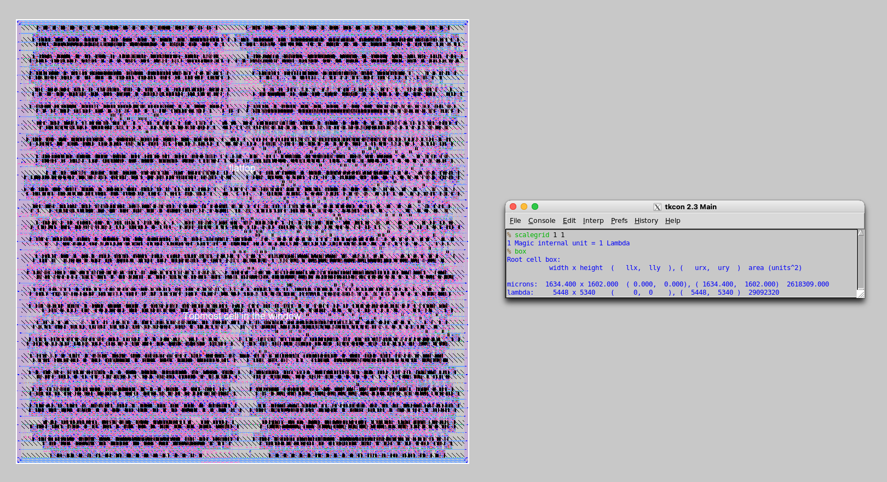
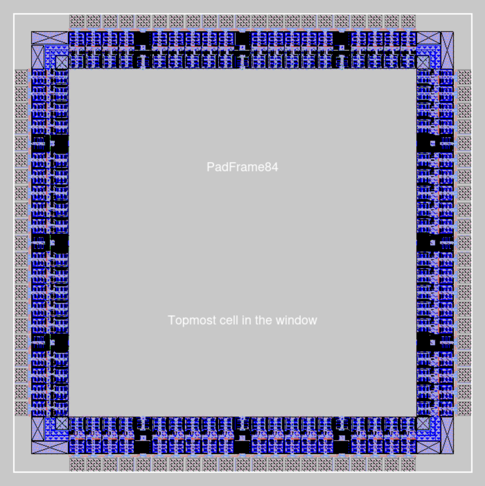
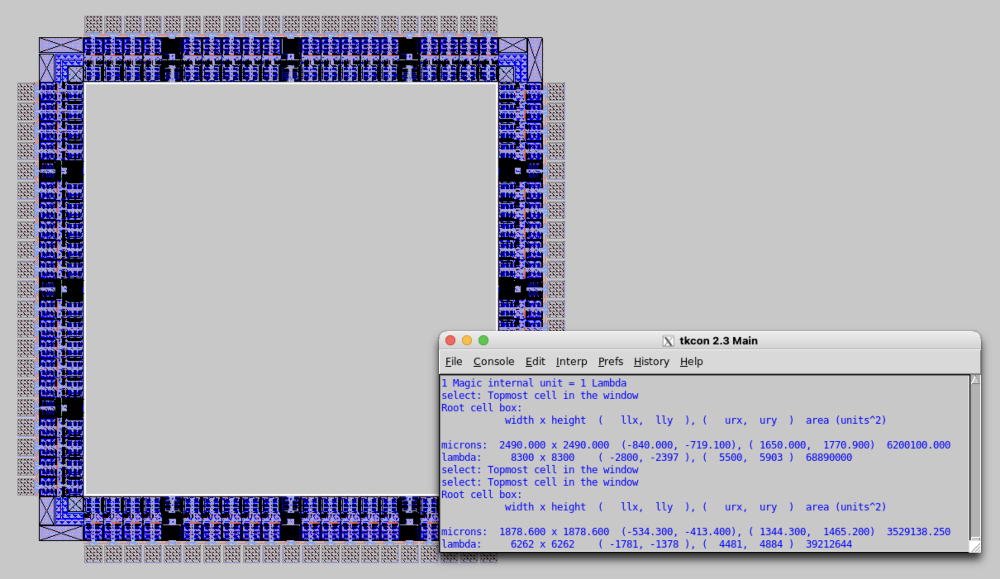

# Post-Layout
This directory contains the post-layout artifacts for SIWADO generated from Cadence Innovus place and route and extracted in Magic. The layout was verified DRC clean in Magic, and integrated into a custom padframe designed to fit the design's area and pin count. The extracted netlist was used for switch-level simulation in IRSIM, with results available in `../testbenches/Post-Layout/`.

  
  
<em>Figure 1: Magic view with box size</em>

  
  
<em>Figure 2a: Custom padframe</em>

  
  
<em>Figure 2b: Custom padframe's areas (external and internal)</em>

