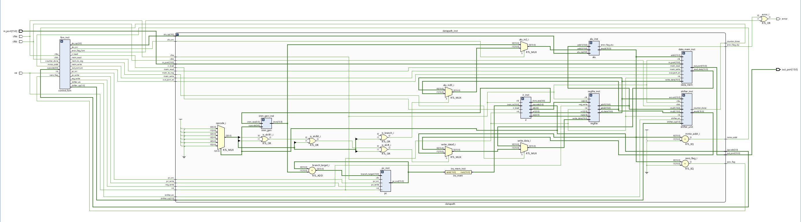

# Architecture
This directory contains the RTL source files for the SIWADO architecture. The top-level module (`top.v`) instantiates the control FSM (control_fsm.v) and the datapath (datapath.v), which in turn instantiates the components listed below. The shifter unit is among most complex components, implementing MAC, CLZ, LSL, and LSR as blocking multi-cycle operations over a shared shift register with a dual-clock interleaved structure. All modules are written in synthesizable Verilog and have been verified pre and post synthesis in Questa and post-layout in IRSIM, with results available in `../testbenches/`

- `alu.v`           –   **ALU**
- `data_mem.v`      –   **Data Memory (RAM/MMIO)**
- `imm_gen.v`       –   **Immediate Generator**
- `ins_mem.v`       –   **Instruction Memory**
- `ir.v`            –   **Instruction Register**
- `pc.v`            –   **Program Counter**
- `regfile.v`       –   **Register File**
- `shifter_unit.v`  –   **Sequential Shifter Unit**

  
  
<em>Figure 1: Expanded RTL view of SIWADO Architecture</em>

