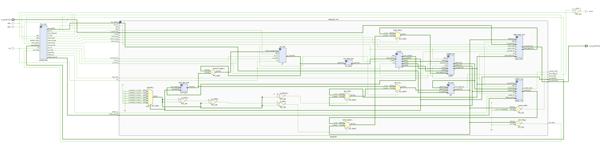

## TO-DO – THU 2 APR
### 1. `shifter_unit.v` should use sequential common shifter also for LSL / LSR (now uses barrel)
### 2. Synthesize final product and resolve any timing issues

NOTE: I am currently finishing the Python assembler and will push it as soon as done.

## SUMMARY OF FIXES – UPDATE OF TUE 24 MAR
### new `control_fsm.v` FSM
- `reg branch_taken` used but never assigned => reversed to 0 if branch taken, 1 otherwise
- wrong alu_op for OP_ADDI => reversed to OP_ADD
- `pc_src` is assigned by output seq block as well as separate branch logic => reversed to only output seq block
- confirmed also branch not taken case is asserted
- fatal error in OP_BEQ / OP_BNE: `zero_flag` is not ready yet when evaluated => added new state BRANCH
- duplicate `HALT` state in seq block @ clkb
- unnecessary `reset` assertion in seq block @ clkb
- added an error flag mechanism for invalid state or opcode handling

### `ins_mem.v`
- instructions `instr` changed from 16'h to 16'b for readability
- instructions `instr` did not replicate commented behavior
- completed integrating `shifter_unit.v` instructions

### `data_mem.v`
- did not check for signal `out_port_en` out of FSM to write
- fixed if-else statement

### `shifter_unit.v`
- fatal error in seq blocks: technology we use does not allow for asynchronous reset
- seq block on posedge(clkb) => changed them to negedge(clkb) to mantain two-phases clock

### `datapath_top.v`
- integrated `shifter_unit` module
- miscellaneous fixes

### `datapath_top_tb.v`
- integrated shifter test
- finalized the testbench integrating all final codes

General commenting in codes and change of names of variables for readability. 

## Structure
alu.v # ALU

data_mem.v # Data Memory (RAM/MMIO)

imm_gen.v # Immediate Generator

ins_mem.v # Instruction Memory

ir.v # Instruction Register

pc.v # Program Counter

regfile.v # Register File

shifter_unit.v # Sequential Shifter Unit

  
  
<em>Figure 1: Expanded SIWADO Architecture</em>

