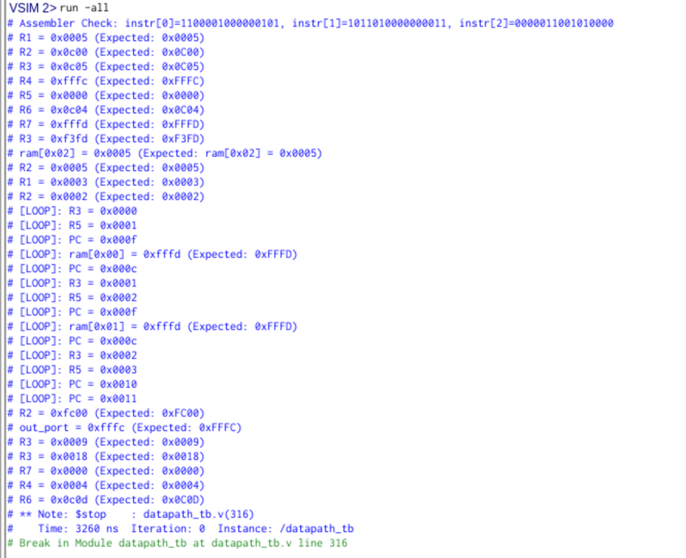
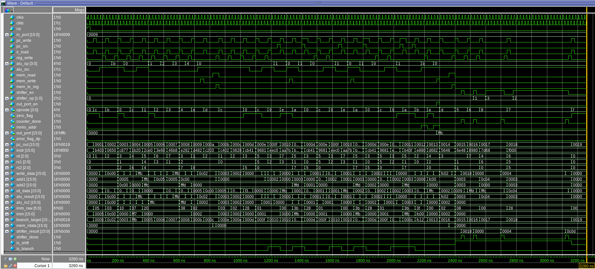
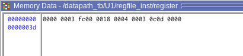
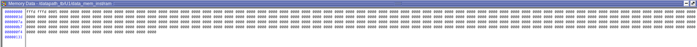

# Verification of Datapath module
## Transcript Output

  
  
<em>Figure 1: Transcript Output</em>

## Waveform

  
  
<em>Figure 2: Waveform of `datapath.v`</em>

## Register File

  
  
<em>Figure 3: Register File</em>

## RAM

  
  
<em>Figure 4: RAM</em>

