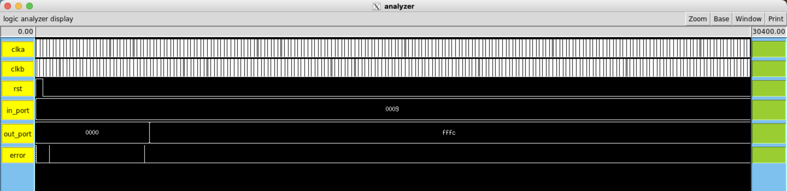

# Verification of Top module
This directory contains the verification artifacts for the SIWADO top module across three stages of the design flow: pre-synthesis RTL simulation, post-Design Compiler gate-level simulation, and post-layout switch-level simulation via IRSIM. Each subfolder contains the testbench, log output, VCD waveform, and a `run` executable to reproduce the simulation. Figures below summarize key results at each stage.

## Before Synthesis

  
  
<em>Figure 1a: FSM Bubble Diagram</em>

  
  
<em>Figure 1b: Instruction Memory at end of simulation</em>

  
  
<em>Figure 1c: Register File at end of simulation</em>

  
  
<em>Figure 1d: Data Memory at end of simulation</em>

  
  
<em>Figure 1e: Waveform of `top.v`</em>

## After Synthesis

  
  
<em>Figure 2: Waveform of `top.vh`</em>

*NOTE: for a cycle-by-cycle log, please check `top_tb.txt` files in pre/post-synthesis subfolders.*

## After Layout

  
  
<em>Figure 3: Waveform of `top.sim`</em>

