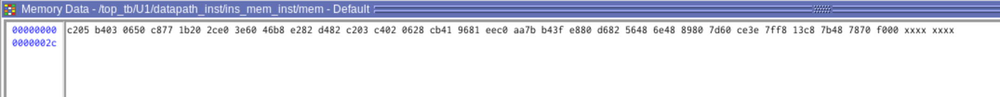
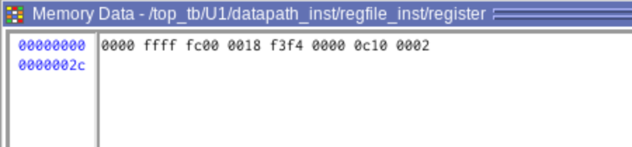
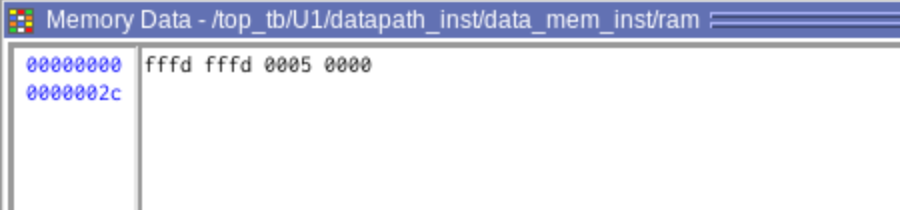
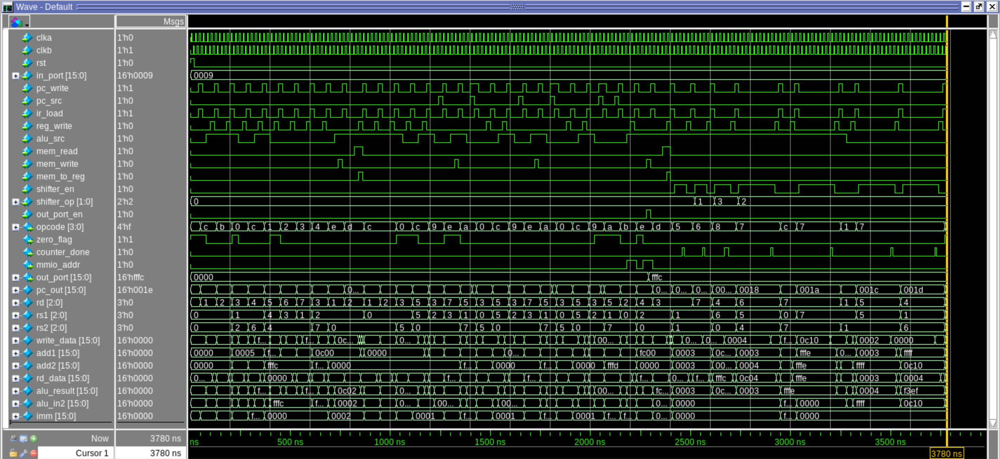
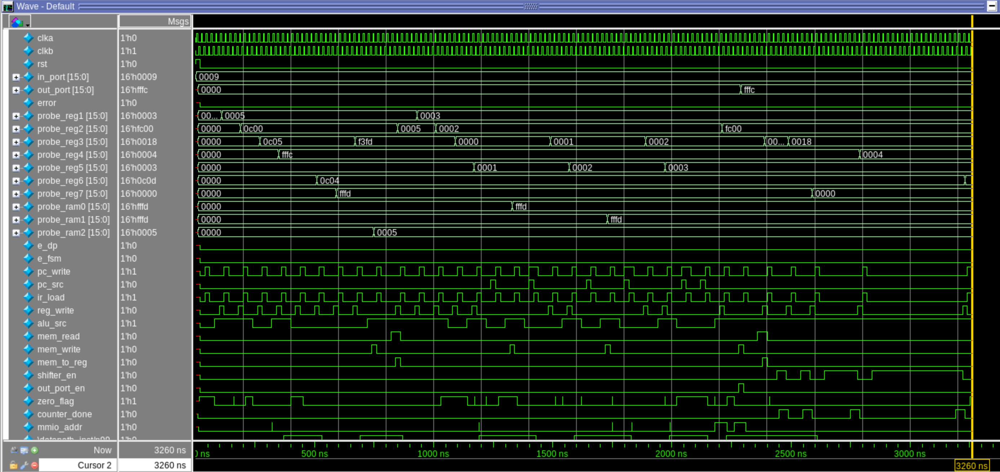
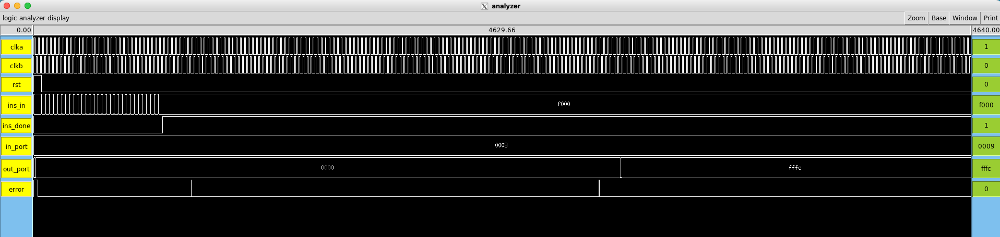
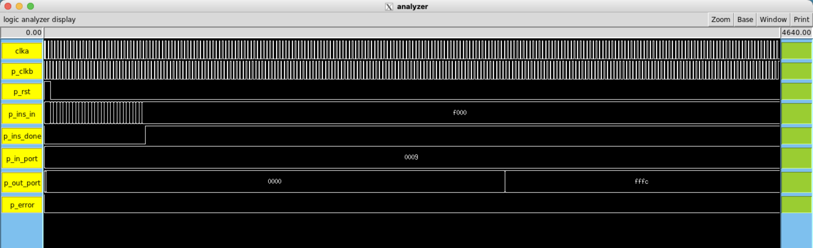

# Verification of Top module
This directory contains the verification artifacts for the SIWADO top module across three stages of the design flow: pre-synthesis RTL simulation, post-Design Compiler gate-level simulation, and post-layout switch-level simulation via IRSIM. Each subfolder contains the testbench, log output, VCD waveform, and a `run` executable to reproduce the simulation. Figures below summarize key results at each stage.

*NOTE: for a cycle-by-cycle log, please check `top_tb.log` files in pre/post-synthesis subfolders.*

## Before Synthesis

  
  
<em>Figure 1a: FSM Bubble Diagram</em>

  
  
<em>Figure 1b: Instruction Memory at end of simulation</em>

  
  
<em>Figure 1c: Register File at end of simulation</em>

  
  
<em>Figure 1d: Data Memory at end of simulation</em>

  
  
<em>Figure 1e: Waveform of `top.v`</em>

## After Synthesis

  
  
<em>Figure 2: Waveform of `top.vh`</em>

## After Layout

  
  
<em>Figure 3a: Waveform of `flattop.sim`</em>

  
  
<em>Figure 3b: Waveform of `SIWADO.sim`</em>

---

# Notes:
## Post-Integration Simulation: Known Extraction Issue

During post-layout simulation with IRSIM, we encountered a bug in Magic's circuit
extractor that affects the connectivity between top-level clock nets and the internal
buffer outputs of the PadBiDir pad cells. Specifically, the extractor fails to correctly
merge node names across the cell boundary between the top-level layout and the PadBiDir
subcell during flattening: the two sides of the boundary get assigned different internal
node names and are never electrically unified in the extracted netlist, leaving the pad
buffer output disconnected from the top-level clock net regardless of which physical
wire contacts it. This was confirmed by trying multiple different connection points and
nearby pins for the `clka` net — none produced correct clock propagation in the extracted
`.sim` file, despite the physical layout connection being visually verified as correct in
Magic. The issue persists even after flattening the full design hierarchy and re-extracting
with Magic 8.3.638 (the current upstream release, compiled and run locally on a separate
machine). This behavior is consistent with the tile-stitching bugs documented in Magic 8.3
revisions 8.3.575, 8.3.587, and 8.3.591, which describe cases where split tiles at cell
boundaries are connected to the wrong node and where hierarchical interactions are missed
in large chip designs. Tim Edwards (Magic maintainer) explicitly noted in early 2026 that
"there is still something wrong in the hierarchical extraction" even after partial fixes
in those revisions.

As a workaround, `clka` was aliased directly to `p_clka` in the `.sim` file to restore
correct clock propagation for simulation purposes. This is electrically equivalent to
what the pad buffer physically implements — passing the external pad signal through to
the core clock net — and does not affect the functional correctness of the simulation.

## References

- Magic 8.3 revision history, revisions 8.3.575–8.3.591:
  http://opencircuitdesign.com/magic/history.html
- R. Timothy Edwards, Magic GitHub repository (open issue on hierarchical extraction):
  https://github.com/RTimothyEdwards/magic